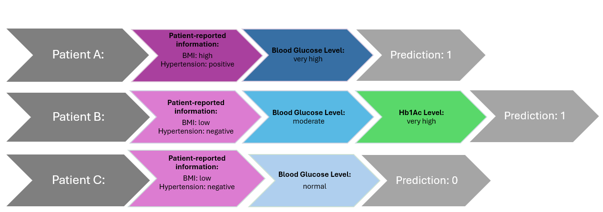

# **P-CAFE**

**P-CAFE** is a Python library designed for feature selection (FS) in electronic health record (EHR) datasets.

This package is based on the following paper-


P-CAFE iteratively selects features in stages, personalizing the FS process to individual cases. It integrates demographic, laboratory, categorical, and textual data iteratively.


#### Installation
   pip install -r requirements.txt


## **Personalized Cost-Aware Feature Selection (FS):**  
  A novel method tailored for EHR datasets, addressing challenges such as:  
  - Multiple data modalities  
  - Missing values  
  - Cost-aware decision-making
  - Personalized and Iterative FS
  - Time series data

## **Building Benchmarks**

To generate the benchmark datasets:  
- **MIMIC-III Numeric**  
  - git clone to https://github.com/YerevaNN/mimic3-benchmarks 
  - Follow the instructions in the README file to build benchmark data 
  - Add to folder .\mimic3-benchmarks\mimic3models\in_hospital_mortality\logistic the following file from data directory: mimicIII_numeric.ipynb
  - Run the notebook file
- **MIMIC-III with Costs**  
  - In order to assign cost:
    1. run the mimicIII_numeric.ipynb
    2. In class myEnv(gymnasium.Env) in DDQN/env_robust.py, define the attribute self.cost_list = [1,2,6,1,1,1,1,7,1,1,2,7,2,2,1,1,7,1]
    to do this uncomment line 18 and comment line 19 in __init__ method
- **MIMIC-III Multi-Modal Dataset**  
- **eICU Dataset**
  - git clone to the repository: https://github.com/mostafaalishahi/eICU_Benchmark.git
  - Follow the code to extract the time series data for inhospital mortality in 48 hours
  - Save the time series data and run P-CAFE

Navigate to the **`data`** directory for instructions.


> **Important:**  
> The MIMIC-III and eICU data are not provided. You must acquire the data independently from [MIMIC-III on PhysioNet](https://mimic.physionet.org/), [eICU on PhysioNet](https://physionet.org/content/eicu-crd/2.0/).

## **Running the Code**

1. run the requirements.txt file to install the required packages.

2. Configuration Setup

    The project uses a hierarchical configuration system. See [docs/CONFIGURATION.md](docs/CONFIGURATION.md) for detailed documentation.
    
    **Quick Start:**
    - Default configuration is in `src/base_config.json`
    - Create `src/user_config.json` to override defaults (optional)
    - Use command-line arguments for runtime overrides
    
    Example:
    ```bash
    python src/embedder_guesser.py --num_epochs 5000 --batch_size 256
    ```

3. Dataset Configuration

    Choose your dataset using the `--data` command-line argument:

    Supported datasets:
    - `pcafe_utils.load_time_Series()` – eICU time series data (default)
    - `pcafe_utils.load_mimic_text()` – MIMIC-III multimodal data (includes clinical text)
    - `pcafe_utils.load_mimic_time_series()` – MIMIC-III numeric time series
    
    Example:
    ```bash
    python src/embedder_guesser.py --data pcafe_utils.load_mimic_text()
    ```
    Open `embedder_guesser.py` and choose your dataset by modifying the `--data` argument passed to the program from runtime command

    Supported datasets:
    - `load_time_Series` – eICU time series data
    - `load_mimic_text` – MIMIC-III multimodal data (includes clinical text)
    - `load_mimic_time_series` – MIMIC-III numeric time series

    Define the feature costs by setting `self.cost_list` in the `MultimodalGuesser` class.

4. Running the embedder_guesser Module

5. For the DDQN agent run **`main_robust.py in the DDQN folder`**, for other agent run **`main_sb3.py`** in the Agents folder and choose the RL agent.


## **Another Example**


We conducted an experiment on the Diabetes Prediction dataset.  
The figure shows that for patients with a high blood glucose level and patient-reported information indicating poor health (e.g., high BMI and positive hypertension status, as in Patient A), the model confidently stops and predicts the patient as diabetic. 
In contrast, when the blood glucose level is moderate (Patient B), the model continues to acquire additional features (HbA1c level) before making a prediction, reflecting the need for further confirmation. 
For patients whose reported information indicates good health and who also exhibit normal glucose levels (Patient C), the model predicts a non-diabetic outcome without requesting further tests. This behavior demonstrates the model’s ability to adaptively halt costly testing when sufficient evidence has already been gathered.