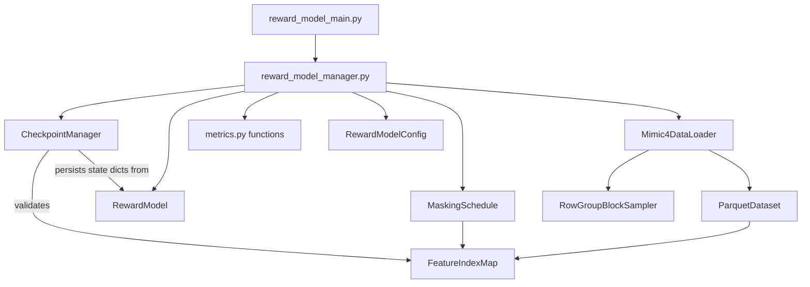

# CDSS-ML Reward Model — Architecture

> **Location:** `HRS/src/reward_model/reward_model_architecture.md`

---

## Table of Contents

1. [Overview](#1-overview)
2. [Prediction Targets](#2-prediction-targets)
3. [Data and Inputs](#3-data-and-inputs)
4. [Feature Set](#4-feature-set)
5. [Pipeline Overview](#5-pipeline-overview)
6. [Module Summary](#6-module-summary)
7. [Technology Stack](#7-technology-stack)
8. [Key Subsystem Detail](#8-key-subsystem-detail)
9. [Final Output](#9-final-output)
10. [Security](#10-security)
11. [Performance](#11-performance)
12. [Design Principles](#12-design-principles)
13. [Directory Structure](#13-directory-structure)
14. [Infrastructure and Execution](#14-infrastructure-and-execution)
15. [MIMIC-IV Reference Configuration](#15-mimic-iv-reference-configuration)

---

## 1. Overview

The CDSS-ML Reward Model is a supervised feedforward neural network that consumes a fixed-length feature vector derived from `final_cdss_dataset.parquet` — produced by `HRS/src/preprocessing` — and outputs T calibrated probability scores, one per configured classification target. Once trained, the model is frozen and used exclusively as an inference module by the RL agent, which computes a potential-based reward from the delta in output probabilities between consecutive episode states: `R = Σ wᵢ · ΔP(Yᵢ)`. The three most important architectural properties are: masking-aware training (the network trains under random and adversarial feature zeroing to simulate partial information availability at RL inference time), multi-GPU distributed training via PyTorch DDP (training runs across 2 GPUs by default, configurable via `NUM_GPUS`), and full configurability (all hyperparameters, schedule parameters, and architectural dimensions are defined in `config/reward_model.yaml` with no hardcoded values).

The current implementation is deployed on MIMIC-IV clinical data with T=2 targets (in-hospital mortality Y1 and 30-day readmission Y2). See Section 15 for the full MIMIC-IV-specific configuration. See `reward_model_design.docx` for the full design rationale. See `PREPROCESSING_ARCHITECTURE.md` for the upstream pipeline that produces the input dataset.

---

## 2. Prediction Targets

The reward model supports T configurable binary classification targets (1 ≤ T ≤ 5). Each target is a float32 label column with values 0, 1, or NaN. A NaN value for a given sample and target indicates that the classification is not applicable for that sample — the reward model excludes that sample from the loss for that target dynamically per batch without removing it from the dataset.

Target definitions — including column names, population scope, and NaN assignment rules — are dataset-specific and are validated by the dataset-specific data loader at startup. For the MIMIC-IV deployment (T=2) see `mimic4_feature_set.md` and Section 15.

---

## 3. Data and Inputs

**Source:** `HRS/data/preprocessing/classifications/final_cdss_dataset.parquet` — produced by `combine_dataset.py` (Step 11 of the preprocessing pipeline). The reward model reads this file directly and does not query MIMIC-IV or any intermediate preprocessing artefacts.

**Schema reference:** The reward model depends on the following columns being present and correctly typed in the dataset file:

- A primary key column (e.g. `hadm_id`, int64, non-null)
- `split` (varchar: `train` / `dev` / `test`) — pre-assigned by the preprocessing pipeline
- T target label columns (float32, nullable — NaN where a target is not applicable for a sample)
- N feature columns (float32, non-null — zero vector for missing features)

The exact column names, target count T, and feature count N are dataset-specific and are validated by the dataset-specific data loader. For the MIMIC-IV schema see `mimic4_feature_set.md`.

**Split strategy:** Patient-level splitting (`subject_id`) is applied upstream by the preprocessing pipeline. The reward model reads the `split` column directly — it does not re-split the data. All statistics derived from data (class weights, temperature scaling parameters) are computed from `split = 'train'` rows only.

| Split | Fraction | Stratification |
|-------|----------|----------------|
| Train | 80% | Primary target (patient-level), seed 42 |
| Dev | 10% | Primary target |
| Test | 10% | Primary target |

---

## 4. Feature Set

The input vector X is constructed by concatenating all feature columns from the dataset file in the canonical column order defined by the upstream preprocessing pipeline. **No separate feature index map config file exists** — feature slot boundaries are derived at load time from the dataset column names and their declared dimensions. The derived index map is held in memory by the dataset-specific data loader (a subclass of the generic `DataLoader` base) and passed to `masking.py` and `reward_model_manager.py`.

**Feature slot structure:** The input vector consists of N feature slots concatenated in a fixed order. Each slot has a declared width (number of float32 dimensions). The total input dimensionality D is the sum of all slot widths.

**Always-visible slots:** The first `NUM_ALWAYS_VISIBLE_FEATURES` slots are always unmasked at episode start, regardless of masking mode. These correspond to information available at the start of each episode. The remaining M = N − `NUM_ALWAYS_VISIBLE_FEATURES` slots are maskable — the RL agent reveals them by transitioning their values from zero to their pre-computed representations as the episode progresses.

**RL visibility convention:** Always-visible slots always appear as the leading slots in the feature vector. This positional convention is enforced by the upstream preprocessing pipeline column order, not by the reward model. The reward model only reads `NUM_ALWAYS_VISIBLE_FEATURES` from config — it has no knowledge of what the slots represent.

**State evolution:** All feature representations are static and pre-computed per sample by the preprocessing pipeline. No re-embedding occurs at RL inference time. State evolution is driven entirely by which feature slots the agent unmasks.

For the complete feature table specific to the current MIMIC-IV deployment — including column names, dimensions, and RL visibility — see `mimic4_feature_set.md` in this directory and Section 15 of this document.

---

## 5. Pipeline Overview

The reward model sits downstream of `HRS/src/preprocessing` and upstream of the RL agent.

```
HRS/src/preprocessing
    └── data/preprocessing/classifications/final_cdss_dataset.parquet
                    │
                    ▼
        ┌──────────────────────────────────────┐
        │   mimic4_data_loader.py              │  read parquet, validate schema,
        │                                       │  derive feature index map,
        │                                       │  build train/dev/test tensors
        └──────────────┬───────────────────────┘
                       │
                       ▼
         ┌──────────────────────────────────────┐
         │   reward_model_main.py (torchrun, NUM_GPUS=2)│  DDP entry; instantiates RewardModelManager
         │   └── RewardModelManager (reward_model_manager.py)         │  masking curriculum, epoch loop,
         │                                       │  forward/backward, early stopping,
         │   GPU 0 ──── mini-batch shard 0       │  checkpointing (rank 0 only)
         │   GPU 1 ──── mini-batch shard 1       │
         │       └── all-reduce gradients        │
         └──────────────┬───────────────────────┘
                       │  best_model.pt (rank 0)
                       ▼
        ┌──────────────────────────────────────┐
        │   calibrate.py                        │  temperature scaling on dev split
        └──────────────┬───────────────────────┘
                       │
                       ▼
          frozen model artefact
    data/reward_model/checkpoints/best_model.pt
                       │
                       ▼
        HRS/src/rl_agent  (inference only — read-only)
```

**Dependency rules:**
- `HRS/src/preprocessing` must have produced `final_cdss_dataset.parquet` before any reward model job runs.
- `Mimic4DataLoader` must pass all schema assertions before `reward_model_manager.py` starts.
- `calibrate.py` requires `best_model.pt` from a completed training run.
- The reward model never writes to `HRS/data/preprocessing/` — that directory is read-only from this module's perspective.

**Runtime estimate (preliminary):**

| Phase | Estimated time | Notes |
|-------|---------------|-------|
| Data loading and validation | 2–5 min | Parquet read + schema assertions |
| Training | Hours–days | 2-GPU DDP; adversarial batches cost 2× per batch |
| Calibration | < 5 min | Single forward pass on dev split, single GPU |

---

## 6. Module Summary

| # | Module | Output | Notes |
|---|--------|--------|-------|
| — | `schema_error.py` | `SchemaError` exception | Class-only module; re-exported by `reward_model_utils.py` |
| — | `reward_model_config.py` | `RewardModelConfig` | Pydantic config model; re-exported by `reward_model_utils.py` |
| — | `parquet_dataset.py` | `ParquetDataset` | Lazy Parquet reader with LRU row-group cache; re-exported by `reward_model_utils.py` |
| — | `row_group_block_sampler.py` | `RowGroupBlockSampler` | Row-group-aware DDP sampler; re-exported by `reward_model_utils.py` |
| — | `dataset_bundle.py` | `DatasetBundle` | Named tuple bundling datasets, feature index map, pos-weights; re-exported by `reward_model_utils.py` |
| — | `checkpoint_manager.py` | `CheckpointManager` | Owns all checkpoint read/write/prune; validates feature index map on resume |
| — | `reward_model_utils.py` | Shared helpers + re-exports | No class definitions; re-exports all class-only modules for backward compatibility |
| 1 | `data_loader.py` | Abstract `DataLoader` base | Template method for open → validate → build index map → split → bundle; subclassed by dataset-specific loaders |
| 2 | `mimic4_data_loader.py` | `DatasetBundle` + feature index map | `Mimic4DataLoader` implementation; enforces upstream data contract and raises on failure with reference to `PREPROCESSING_DATA_MODEL.md` |
| 3 | `model.py` | `RewardModel` class | MLP definition only — no training logic; T output heads (T=2 for MIMIC-IV); wrapped in `DistributedDataParallel` by `reward_model_manager.py` |
| 4 | `masking.py` | Masked input tensors | Reads feature index map; implements random (variable k per sample), adversarial (top-k by RMS gradient norm), and no-mask modes; always-visible slots never masked |
| 5 | `metrics.py` | Metrics + logging | Contains `compute_metrics()` and `_append_metrics_row()` for AUROC/AUPRC/ECE computation and metrics parquet logging |
| 6 | `reward_model_manager.py` | Checkpoint files | Contains `RewardModelManager` class; handles dataset loading/broadcast, model/optimizer/scheduler build, loss computation, masking curriculum, epoch loop, dev eval, checkpointing, and metrics |
| 6a | `reward_model_main.py` | Process exit code | DDP entry point via `torchrun`; owns CLI parsing, logging setup, runtime init, resume wiring, and delegates to `RewardModelManager` |
| 7 | `calibrate.py` | `calibration_params.json` | Per-head temperature scaling on dev split using log-space L-BFGS; single GPU |
| 8 | `inference.py` | Probability tensors | Frozen forward pass; consumed by RL agent; single GPU |
| 9 | `validate_contract.py` | Exit code 0/1 | Standalone schema assertion runner; metadata-only, no tensor construction |
| 10 | `export_model.py` | `frozen_model.pt` | Serialise frozen model + calibration params + feature index map for RL consumption |

### Dependency diagram (modules and classes)



Edges show module-level dependencies (train orchestrates all) and class-level dependencies (e.g., `CheckpointManager` validates the feature index map produced by `Mimic4DataLoader` and persisted with `RewardModel` state).

Supporting scripts (not in the training pipeline): `validate_contract.py` (standalone schema assertion runner without training), `export_model.py` (serialise frozen model for RL consumption).

---

## 7. Technology Stack

### Language and Runtime

Python 3.11+. CUDA 12.x required for GPU training. `torchrun` is used as the DDP launcher — it manages process spawning, rank assignment, and the `MASTER_ADDR`/`MASTER_PORT` environment variables. Consistent with `HRS/src/preprocessing` in language, CUDA version, and cluster environment.

### Core Frameworks and Libraries

| Library | Version | Role | Why chosen |
|---------|---------|------|------------|
| `torch` | ≥ 2.2 | Neural network, DDP, training loop, autograd | Standard; `BCEWithLogitsLoss` supports `pos_weight` natively; `DistributedDataParallel` for multi-GPU |
| `torch.distributed` | — | All-reduce gradient synchronisation across GPUs | Built into PyTorch; nccl backend for GPU-to-GPU communication |
| `pandas` | ≥ 2.0 | Parquet loading, label validation, NaN operations | Consistent with preprocessing; `df.loc` NaN operations are the canonical contract step |
| `pyarrow` | ≥ 14.0 | Parquet reads | Read-only access — no append needed, unlike preprocessing which uses `fastparquet` for append-mode writes |
| `pydantic` | ≥ 2.0 | `config/reward_model.yaml` validation at startup | Catches misconfigured schedules before training starts; consistent with preprocessing |
| `pyyaml` | ≥ 6.0 | Config loading | Human-editable; loaded once at startup; same convention as `config/preprocessing.yaml` |
| `scikit-learn` | ≥ 1.4 | AUROC, AUPRC, ECE metrics; calibration utilities | Mature, well-tested implementations |
| `numpy` | ≥ 1.26 | Tensor construction, NaN masking | Required by pandas and torch interop |

### Data Structures and Storage Formats

- **Parquet (`final_cdss_dataset.parquet`, input, read-only):** Columnar; predicate pushdown used for `split` filtering. Produced upstream via `fastparquet` append mode — this module reads with `pyarrow`.
- **YAML (`config/reward_model.yaml`):** All hyperparameters and schedule parameters. Validated by Pydantic. Follows the same convention as `config/preprocessing.yaml`.
- **PyTorch checkpoint (`best_model.pt`):** Weights (unwrapped from DDP), optimizer state, epoch, curriculum state, config snapshot. Written by rank 0 only. Enables full SLURM resume.
- **JSON (`calibration_params.json`):** Per-head temperature values, one per target (e.g. `T_0`, `T_1`). Human-readable audit trail.
- **Parquet (`training_metrics.parquet`):** Per-epoch metrics written by rank 0. Columnar for downstream analysis.

### What Was Explicitly Rejected

- **`BCELoss` (without logits):** Rejected — numerically unstable; no native `pos_weight` support.
- **T independent sigmoid heads rather than shared softmax output:** Rejected for multi-target setups where some targets are conditionally defined (NaN for non-applicable samples). A softmax implicitly assumes all T targets are defined for every sample. T independent sigmoid heads with dynamic per-target NaN masking correctly represent the label structure where each target may have a different applicable population.
- **Internal projection / fusion layers:** Rejected. Dimensionality reduction of BERT embeddings belongs in `HRS/src/preprocessing`, not in the network.
- **Separate `feature_index_map.yaml` config:** Rejected. Feature slot boundaries are derived at load time from the canonical column order in `PREPROCESSING_DATA_MODEL.md` Section 3.12. A separate file would duplicate that information and create a consistency risk.
- **Fixed global importance ranking for adversarial masking:** Rejected. A ranking computed once does not adapt as the network evolves. Per-batch per-sample gradient-based selection (Shaham et al., 2016) is used instead.
- **`torch.multiprocessing` spawn workers (preprocessing pattern):** Not applicable here. Preprocessing uses worker processes because the bottleneck is independent embedding jobs per feature. Training uses DDP where all processes must synchronise gradients every step — `torchrun` with `nccl` backend is the correct multi-GPU pattern.
- **`fastparquet` for reading:** Preprocessing uses `fastparquet` for append-mode writes; read-only access here uses `pyarrow` to avoid the fastparquet/pyarrow serialisation incompatibility encountered in the preprocessing pipeline.

---

## 8. Key Subsystem Detail

### 8.1 Upstream Data Contract

`Mimic4DataLoader` enforces the following assertions at startup. All failures raise with a descriptive error message referencing `PREPROCESSING_DATA_MODEL.md` and the producing module.

**Target label columns must be float32 with mathematical NaN (not zero, not a sentinel integer) where a target is not applicable for a sample.** If a non-applicable sample carries `0.0` instead of NaN, the per-target NaN mask silently includes that sample in the loss for that target, corrupting the learned conditional distribution without any visible error. The NaN assignment rules are dataset-specific and are validated by the dataset-specific data loader at startup.

**All feature columns must be float32 non-null.** Missing features are zero vectors — never NaN. NaN inside a feature column propagates silently through all MLP layers and corrupts loss, gradients, and adversarial importance scores.

**The primary target label column must be non-null for every row.** Partial NaN is only valid for secondary targets where the classification is conditionally defined.

### 8.2 Feature Index Map Derivation

At load time, `Mimic4DataLoader` reads the ordered column list from `final_cdss_dataset.parquet` and constructs a feature index map in memory: `{'demographic_vec': (0, 8), 'diag_history_embedding': (8, 776), ...}`. This map is passed to `masking.py` and `reward_model_manager.py` and never written to disk. The canonical column order is defined in `PREPROCESSING_DATA_MODEL.md` Section 3.12 — any upstream change to feature count or order is automatically reflected at reward model load time.

#### Checkpoint manager and feature-index validation

Checkpointing and resume logic is encapsulated in `CheckpointManager` (`checkpoint_manager.py`). It owns writing `epoch_<N>.pt` and `best_model.pt`, and it snapshots the feature index map alongside weights, optimizer state, and config. On `--resume`, `CheckpointManager.validate_feature_index_map()` compares the checkpoint snapshot to the freshly derived map from `final_cdss_dataset.parquet`; a mismatch raises immediately and aborts the resume to prevent running with shifted feature boundaries after an upstream schema change.

### 8.3 Multi-GPU Distributed Training

Training uses PyTorch `DistributedDataParallel` (DDP) launched via `torchrun`. The number of GPUs is controlled by `NUM_GPUS` in `config/reward_model.yaml` (default: 2). `torchrun` spawns one process per GPU, each with a unique `rank`. Each process loads a full copy of the model. A `RowGroupBlockSampler` shards the training data across ranks at the row-group level — shuffling row groups rather than individual row indices — to preserve Parquet row-group locality and prevent I/O thrashing on the `ParquetDataset` LRU cache. Gradients are all-reduced across GPUs after each backward pass. Checkpointing, metric logging, and masking curriculum state are managed by rank 0 only to avoid duplicate writes.

The `nccl` backend is used for GPU-to-GPU communication, consistent with best practice for PyTorch DDP on CUDA hardware. If only 1 GPU is available, training runs in single-process mode without DDP wrapping.

Adversarial masking under DDP requires attention: the first forward/backward pass (to compute gradient norms for adversarial slot selection) must be performed with `model.no_sync()` to suppress premature all-reduce, since only the second pass should trigger gradient synchronisation across GPUs.

### 8.4 Masking Strategy and Curriculum

Three masking modes are applied externally to the network before each forward pass. The network receives a fixed-length D-dimensional float32 tensor with no awareness of which slots are masked.

**Always-visible slots:** The first `NUM_ALWAYS_VISIBLE_FEATURES` slots (default 5 — F1–F5) are never candidates for masking. These correspond to information available at episode start. The remaining M = 51 slots are maskable. This is a positional convention: always-visible slots are always the leading slots in the feature index map, enforced by the preprocessing pipeline column order.

**Random masking** zeroes k feature slots selected uniformly at random per sample, where k is drawn independently per sample from `Uniform(floor(min_fraction × M), ceil(max_fraction × M))` with the configured random k fraction range (default [0.5, 1.0)). The lower bound is clamped to ≥ 1 and the upper bound to ≤ M−1, with a final safety guard setting lower = upper if they still invert after clamping.

**Adversarial masking** implements Shaham et al. (2016) robust optimisation adapted for discrete feature-slot masking: a first forward pass with `model.no_sync()` computes per-slot RMS gradient magnitude by aggregating `∂L/∂x` over each slot's index range and dividing by the square root of slot dimension (for dimensionality-invariant comparison across slots of different widths). Slots are sorted by importance descending and the top k are zeroed per sample, where k is drawn from the configured adversarial k fraction range (default [0.3, 0.7]). A second forward/backward pass (with DDP all-reduce) updates weights. This doubles the cost of adversarial batches.

**No masking** passes the full vector unchanged.

The probability of each mode evolves via a configurable sigmoid crossover schedule. Default: 100% random at epoch 0, transitioning to 33%/33%/33% by the final epoch. All schedule parameters are in `config/reward_model.yaml`.

### 8.5 Loss Function and Class Imbalance

Total loss: `L = Σᵢ wᵢ * L_Yᵢ` summed over all T targets. Weights are normalised to sum to 1.0 (validated by `RewardModelConfig` at startup), keeping total loss magnitude invariant as T changes. For the MIMIC-IV default (T=2): `w1 = 0.75`, `w2 = 0.25` (3:1 ratio favouring mortality). Each `L_Yᵢ` uses `BCEWithLogitsLoss` with the corresponding `pos_weight_i` and applies a dynamic per-batch NaN mask to exclude non-applicable samples for that target. The all-NaN-batch edge case for any target sets `L_Yᵢ = 0.0` explicitly. All `pos_weight` values are computed once from `split = 'train'` rows on rank 0 and broadcast to all ranks before training begins. See Section 15.3 for MIMIC-IV default values.

### 8.6 Neural Network Architecture

The network is a feedforward MLP with a gradual funnel. Under DDP, each GPU holds a full model copy (~1.32 GB for Hidden 1 alone at float32). With 2 GPUs and AdamW optimizer state, total GPU memory per device is approximately 14–18 GB at batch size 256 per GPU (512 effective). The recommended mitigation if memory is exceeded is PCA reduction of BERT embeddings (768 → 256) applied in `HRS/src/preprocessing` — input reduces to ~14,088 dims with no architectural change to this module.

The number of output heads T equals the number of configured classification targets. All layer widths and dropout rates are configurable in `config/reward_model.yaml`. Dropout is configured per layer (`DROPOUT_RATES` as a list) to allow heavier regularisation on wider early layers. The first hidden layer width should be adjusted when D changes significantly from the MIMIC-IV default (42,248).

| Layer | In | Out | Activation | Dropout rate |
|-------|----|-----|------------|--------------|
| Hidden 1 | D | 8,192 | ReLU + BatchNorm | 0.4 |
| Hidden 2 | 8,192 | 2,048 | ReLU + BatchNorm | 0.3 |
| Hidden 3 | 2,048 | 512 | ReLU + BatchNorm | 0.3 |
| Hidden 4 | 512 | 128 | ReLU + BatchNorm | 0.2 |
| Head Y1…YT | 128 | 1 each | Sigmoid | — |

### 8.7 Post-Training Calibration

Temperature scaling is applied on the dev split after training converges, on a single GPU. A scalar temperature T is learned per output head via NLL minimisation in log-space — weights are not modified. Well-calibrated probabilities are critical because the RL reward is `ΔP` between consecutive states. One temperature value per target is written to `data/reward_model/calibration_params.json` and applied at inference time.

---

## 9. Final Output

**Frozen model:** `HRS/data/reward_model/checkpoints/best_model.pt` — PyTorch state dict (unwrapped from DDP), calibration parameters, feature index map snapshot, and config. Loaded by `inference.py` for the RL agent.

**Training metrics:** `HRS/data/reward_model/training_metrics.parquet` — written by rank 0.

| Column group | Columns | Type |
|---|---|---|
| Epoch metadata | `epoch`, `wall_time_s`, `masking_random_pct`, `masking_adversarial_pct`, `masking_none_pct` | int / float32 |
| Loss | `loss_total`, `loss_target_0`, `loss_target_1`, ..., `loss_target_{T-1}` | float32 |
| Per-target performance (unmasked — dev) | `auroc_target_i`, `auprc_target_i`, `ece_target_i` for each i | float32 |
| Per-target performance (masked — train diagnostic) | `auroc_target_i_masked`, `auprc_target_i_masked` for each i | float32 |

Dev metrics (unmasked) are the primary signals for early stopping and progress monitoring. Training masked metrics are diagnostic — they track the gap between masked and unmasked AUROC as the curriculum evolves.

---

## 10. Security

This module processes de-identified MIMIC-IV data under the PhysioNet data use agreement on the university HPC cluster. Log statements reference row counts and aggregate statistics only — no individual patient record contents. Model checkpoints contain learned weights only, not training data. The PhysioNet data use agreement prohibits sharing raw MIMIC-IV data or derivatives that could re-identify patients outside the credentialed research group. No API keys or credentials are used by this module — MIMIC-IV access is managed by `HRS/src/preprocessing` only.

---

## 11. Performance

**Dominant bottleneck — Hidden 1 weight matrix.** The D × 8,192 matrix (where D is the total input dimensionality) occupies ~1.32 GB at float32 per GPU for the MIMIC-IV default D=42,248. Under DDP with `nccl` all-reduce, each GPU holds a full model copy — memory savings from 2-GPU DDP come from halving the per-GPU effective batch size, not from splitting model weights. With AdamW optimizer state (~3× parameter size), Hidden 1 alone requires ~5 GB per GPU before activations.

**Effective batch size with DDP.** With `batch_size = 256` per GPU and 2 GPUs, the effective batch size is 512. Each GPU processes 256 samples per forward/backward pass. At batch size 256 per GPU, estimated total GPU memory per device is 14–18 GB.

**Adversarial masking cost.** Each adversarial batch requires two forward/backward passes (first with `no_sync()`, second with all-reduce). At the default end-state curriculum (33% adversarial), ~33% of batches cost 2×. Wall time per epoch is logged in `training_metrics.parquet` by rank 0.

**Scaling knobs:**

| Knob | Config key | Effect |
|------|-----------|--------|
| GPU count | `NUM_GPUS` | Linear throughput scaling up to available GPUs |
| Reduce Hidden 1 width | `layer_widths[0]` | Cuts first-layer parameters quadratically |
| Reduce batch size per GPU | `batch_size` | Reduces per-GPU activation memory |
| PCA in preprocessing | Applied in `HRS/src/preprocessing` | Reduces input to ~14,088 dims; no network change |
| Reduce adversarial ratio | `masking_end_ratios` | Reduces proportion of double-pass batches |

**Throughput:** Not yet characterised on target hardware. Anticipated bottleneck is Hidden 1 forward pass (dense matrix multiply), not I/O — the dataset fits in RAM via lazy `ParquetDataset` loading.

See `REWARD_MODEL_DETAILED_DESIGN.md` for per-module memory requirements and full configuration reference.

---

## 12. Design Principles

**No leakage across splits.** All statistics derived from data — `pos_weight_y1`, `pos_weight_y2`, temperature scaling parameters — are computed from `split = 'train'` rows only, computed on rank 0, broadcast to all ranks, and frozen for the training run. The split assignment is read from the upstream dataset; this module never re-splits data.

**Hard contracts, hard failures.** Upstream schema violations raise immediately in `Mimic4DataLoader` with descriptive error messages referencing `PREPROCESSING_DATA_MODEL.md` by section and the producing module by name.

**No hardcoded values.** Every hyperparameter, architectural dimension, schedule parameter, file path, and GPU count is defined in `config/reward_model.yaml` and validated by Pydantic on startup. Input dimensionality is derived at runtime from the dataset column schema.

**Preprocessing owns dimensionality.** BERT embedding dimensions, PCA reduction choices, and feature count are decisions made in `HRS/src/preprocessing`. The reward model accepts whatever `final_cdss_dataset.parquet` provides.

**Masking is external to the network.** The network receives a flat float32 tensor and has no awareness of masked slots. All masking logic lives in `masking.py`, entirely decoupled from `model.py`.

**Feature boundaries are derived, not declared.** The feature index map is constructed at load time from the canonical column order in `PREPROCESSING_DATA_MODEL.md` Section 3.12. No separate index map config file exists.

**One class per file.** Each class definition lives in its own `*.py` module (for example, `RewardModelConfig` in `reward_model_config.py`, `ParquetDataset` in `parquet_dataset.py`). Shared helpers and constants (for example, `ALWAYS_VISIBLE_SLOTS`, `get_device()`) live in `reward_model_utils.py` alongside the backward-compatibility re-exports for the class modules.

**Rank 0 owns all I/O.** Under DDP, only rank 0 writes checkpoints, metrics, and logs. All ranks participate in forward/backward passes and gradient all-reduce. This prevents duplicate writes and ensures a consistent checkpoint state.

**Resumability.** Every checkpoint saves model weights (unwrapped from DDP), optimizer state, current epoch, curriculum schedule state, and a full config snapshot. Re-running `reward_model_manager.py --resume` via `torchrun` continues from the last checkpoint. Schema validation runs on every start regardless of resume status.

---

## 13. Directory Structure

```
HRS/
├── config/
│   ├── preprocessing.yaml                   # owned by HRS/src/preprocessing
│   └── reward_model.yaml                    # all reward model hyperparameters and schedule params
│
├── src/
│   ├── preprocessing/                       # upstream pipeline
│   │   └── ...
│   │
│   └── reward_model/
│       ├── reward_model_architecture.md     # this document
│       ├── REWARD_MODEL_DETAILED_DESIGN.md  # per-module implementation details
│       │
│       ├── mimic4_data_loader.py           # step 1 — load, validate schema, derive feature index map
│       ├── model.py                         # step 2 — RewardModel MLP definition
│       ├── masking.py                       # step 3 — random / adversarial / no-mask modes
│       ├── metrics.py                       # step 4 — AUROC/AUPRC/ECE computation + metrics parquet logging helpers
│       ├── reward_model_main.py             # step 5 — DDP entrypoint launched by torchrun
│       ├── reward_model_manager.py                         # RewardModelManager class: loss computation, curriculum, epoch loop, checkpointing
│       ├── calibrate.py                     # step 6 — temperature scaling on dev split
│       ├── inference.py                     # step 7 — frozen forward pass for RL agent
│       │
│       ├── schema_error.py                  # shared SchemaError exception (class-only file)
│       ├── reward_model_config.py           # Pydantic RewardModelConfig + loader (class-only file)
│       ├── parquet_dataset.py               # ParquetDataset class (lazy Parquet reader)
│       ├── row_group_block_sampler.py       # RowGroupBlockSampler class (row-group-aware sampler)
│       ├── dataset_bundle.py                # DatasetBundle NamedTuple (train/dev/test bundle)
│       ├── reward_model_utils.py            # shared helpers + re-exports (no class definitions)
│       │
│       ├── reward_job.sh                    # SLURM: training job (2× GPU, 64G)
│       ├── calibrate_job.sh                 # SLURM: calibration job (1× GPU, 32G)
│       ├── submit_reward.sh                 # submit training then calibration with dependency chain
│       │
│       ├── validate_contract.py             # standalone: schema assertions without training
│       └── export_model.py                  # standalone: serialise frozen model for RL agent
│
└── data/
    ├── preprocessing/                       # [git-ignored] owned by HRS/src/preprocessing
    │   └── classifications/
    │       └── final_cdss_dataset.parquet   # primary input to reward model (read-only)
    │
    └── reward_model/                        # [git-ignored] generated by this module
        ├── checkpoints/
        │   ├── best_model.pt
        │   └── epoch_<N>.pt
        ├── training_metrics.parquet
        └── calibration_params.json
```

---

## 14. Infrastructure and Execution

### Cluster and Environment

University HPC cluster running SLURM — same cluster as `HRS/src/preprocessing`. Partition names, GPU type, time limits, and RAM are defined in `config/reward_model.yaml`. Two GPUs per training job (default; controlled by `NUM_GPUS`). GPU with ≥24 GB VRAM recommended per device. CUDA 12.x, Python 3.11+.

### Capacity Sizing

Under DDP with 2 GPUs, each GPU holds a full model copy. For the MIMIC-IV default (D=42,248): Hidden 1 weight matrix (42,248 × 8,192, ~1.32 GB float32) plus AdamW optimizer state requires ~5 GB per GPU before activations. At batch size 256 per GPU, total estimated GPU memory per device is 14–18 GB. A 24 GB GPU (A100 or equivalent) provides sufficient headroom. If memory is exceeded, apply PCA (768 → 256) in `HRS/src/preprocessing` — input reduces to ~14,088 dims, Hidden 1 to ~231 MB, with no changes to this module.

### Scripts

All SLURM scripts live alongside the Python modules in `HRS/src/reward_model/`.

| Script | GPUs | RAM | Purpose |
|--------|------|-----|---------|
| `reward_job.sh` | 2 | 64G | DDP training run via `torchrun` |
| `calibrate_job.sh` | 1 | 32G | Temperature scaling after training |
| `validate_contract.py` | 0 | 16G | Schema assertion check only |
| `export_model.py` | 0 | 8G | Serialise frozen model for RL agent |

### How to Run

```bash
# Validate upstream data contract before submitting training
cd ~/Python/HRS
python src/reward_model/validate_contract.py --config config/reward_model.yaml

# Submit training then calibration as a chained SLURM dependency
bash src/reward_model/submit_reward.sh

# Resume after preemption (torchrun re-launches all DDP workers)
torchrun --nproc_per_node=2 src/reward_model/reward_model_main.py \
  --config config/reward_model.yaml \
  --resume
```

### Job Chain

```
[validate_contract.py]
          │  assertions pass
          ▼
[reward_job.sh]  (torchrun, 2 GPUs)
   rank 0 + rank 1 ── SLURM preemption ──► [reward_job.sh --resume]
          │  best_model.pt written by rank 0
          └──(afterok)──► [calibrate_job.sh]  (single GPU)
                                   │  calibration_params.json written
                                   ▼
                            [export_model.py]
                                   │  frozen model artefact
                                   ▼
                            HRS/src/rl_agent
```

### Resume Guarantee

Re-running `reward_job.sh --resume` relaunches `torchrun` with 2 workers. Each worker loads the latest checkpoint from `data/reward_model/checkpoints/`, restores optimizer state and curriculum schedule, and continues from the saved epoch. Schema validation via `Mimic4DataLoader` runs on every start regardless of resume status. Only rank 0 reads and writes the checkpoint — rank 1 receives the loaded state via DDP process group initialisation.

---

> See `REWARD_MODEL_DETAILED_DESIGN.md` for per-module implementation details, full `config/reward_model.yaml` reference, and per-layer memory requirements.
>
> See `PREPROCESSING_ARCHITECTURE.md` and `PREPROCESSING_DATA_MODEL.md` for the upstream pipeline that produces `final_cdss_dataset.parquet`.

---

## 15. MIMIC-IV Reference Configuration

This section documents the specific configuration of the Reward Model for the MIMIC-IV clinical dataset. All values here are the defaults in `config/reward_model.yaml`. When deploying on a different dataset, update these values while leaving all generic framework code unchanged.

### 15.1 Prediction Targets (T=2)

| Target | Config index | Column | Definition | Population | Positive rate |
|--------|-------------|--------|------------|------------|---------------|
| Y1 — In-hospital mortality | 0 | `y1_mortality` | `admissions.hospital_expire_flag = 1` | All admissions | ~8–10% |
| Y2 — 30-day readmission | 1 | `y2_readmission` | Unplanned readmission within 30 days of `dischtime` | Survivors only (`y1_mortality = 0`) | ~20% |

**NaN convention:** Y2 = NaN for all rows where Y1 = 1. Readmission is undefined for deceased patients. The reward model excludes NaN rows from the Y2 loss dynamically per batch — no samples are removed from the dataset.

### 15.2 Input Dimensionality

| Property | Value |
|----------|-------|
| Total feature slots | 56 (F1–F56) |
| Always-visible slots | 5 (F1–F5: demographics, diagnosis history, discharge summary, triage, chief complaint) |
| Maskable slots (M) | 51 (F6–F56: lab groups, radiology, microbiology panels) |
| Total input dimensionality D | 8 + (55 × 768) = **42,248** |

### 15.3 Loss Configuration

| Parameter | Value | Rationale |
|-----------|-------|-----------|
| `LOSS_WEIGHT_Y1` | 0.75 | Mortality has lower positive rate (~8–10%); higher weight compensates |
| `LOSS_WEIGHT_Y2` | 0.25 | Readmission more frequent (~20%); lower weight |
| `pos_weight_Y1` | ~9.0 (computed) | n_negative / n_positive from training split |
| `pos_weight_Y2` | ~4.0 (computed) | Computed from survivors in training split only |

Weights sum to 1.0 — normalisation is enforced by `RewardModelConfig` at startup.

### 15.4 Reward Formula

```
R = w₁ · ΔP(dies) + w₂ · ΔP(readmitted | survived)
```

where `w₁` and `w₂` are RL agent reward weights (distinct from training loss weights above) and Δ denotes the change in probability between consecutive episode steps. Reward weights and sign convention are defined by the RL agent design document.

### 15.5 Default Layer Configuration

| Layer | In | Out | Dropout |
|-------|----|-----|---------|
| Hidden 1 | 42,248 | 8,192 | 0.4 |
| Hidden 2 | 8,192 | 2,048 | 0.3 |
| Hidden 3 | 2,048 | 512 | 0.3 |
| Hidden 4 | 512 | 128 | 0.2 |
| Head Y1, Head Y2 | 128 | 1 each | — |
